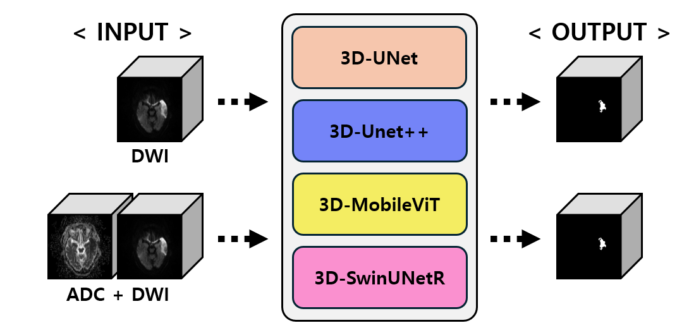

# Investigation of Deep Learning Models and Training Strategies for Brain Stroke Segmentation

[](https://opensource.org/licenses/MIT)
[](https://pytorch.org/)
[](#)
[](https://monai.io/)
[](https://wandb.ai/)


This is the official PyTorch implementation for the paper: **"Investigation of Deep Learning Models and Training Strategies for Brain Stroke Segmentation"**.

## 📖 Abstract
In this study, we investigate deep learning models for an effective and efficient lesion segmentation in 3D brain diffusion weighted images (DWI).
We compare Convolutional Neural Networks (CNNs) and Transformer-based models, specifically employing 3D-UNet, 3D-UNet++, 3D-MobileViT, and 3D-SwinUNetR.
The experimental results, utilizing DWI and ADC (apparent diffusion coefficient) images of 651 brain stroke patients, demonstrate that combining DWI and ADC images yields better segmentation performance than using DWI alone.

## 🖼️ Qualitative Results

*(Figure description: Qualitative comparison of brain stroke segmentation results using different deep learning models.)*

## 🚀 Key Findings & Performance
Our experiments demonstrate that the Transformer-based **3D-SwinUNetR** achieved the highest performance. Furthermore, models trained on the combined DWI and ADC images outperformed those trained solely on DWI.

### Quantitative Results (Dice-score)
*Evaluation based on combining DWI and ADC images:*

| Model            |   Large   |  Medium   |   Small   |  Average  |
|:-----------------|:---------:|:---------:|:---------:|:---------:|
| 3D-UNet          |   0.819   |   0.686   |   0.523   |   0.676   |
| 3D-UNet++        |   0.826   |   0.704   |   0.599   |   0.710   |
| 3D-MobileViT     |   0.815   |   0.718   |   0.570   |   0.701   |
| **3D-SwinUNetR** | **0.838** | **0.750** | **0.650** | **0.746** |

> Note: The models demonstrate varying performance depending on the sparsity of the lesion, performing best on "Large" lesions and showing decreased Dice-scores for "Small" lesions.

## ⚙️ Environment & Requirements
All experiments were conducted using an **NVIDIA RTX A6000 GPU**.
* Python 3.10+
* PyTorch
* MONAI (for 3D-SwinUNetR)
```bash
# Install dependencies
conda create -n dwi_seg python=3.10
conda activate dwi_seg
pip install -r requirements.txt
```

## 🛠️ Usage
### 1. Data Preparation
The datasets used in this repository are private. To run the code, please prepare your own dataset with DWI and ADC images provided as pairs.

(The framework expects a user-provided final_mask.npy to refine the segmentation results; the generation of this mask is not handled by the current pipeline.)
```bash
python split_dataset.py --base_dir "./dataset"
```

### 2. Training
```bash
# Train 3D-SwinUNetR with DWI and ADC combined
python train_n_validation.py --model swinunetr --input_type combined --batch_size 2
```

### 3. Visualization & Evaluation
```bash
python visualize_n_evaluate.py --model swinunetr --checkpoint ./weights/best_model.pth
```

## 📝 Citation
If you find this repository useful in your research, please consider citing our paper:

```bibtex
@article{DWILesionBenchmark,
  title={Investigation of Deep Learning Models and Training Strategies for Brain Stroke Segmentation},
  author={H. Yang and S. Jung and T. T. Vuong and B. C. Doanh and H. Roh and H. Kim and J. Kwak},
  journal={IEIE},
  url={http://www.dbpia.co.kr/journal/articleDetail?nodeId=NODE11890388},
  year={2024}
}
```

## 📧 Contact
For any inquiries, please contact Hyun Yang at `goodtobehomeyh@gmail.com`.